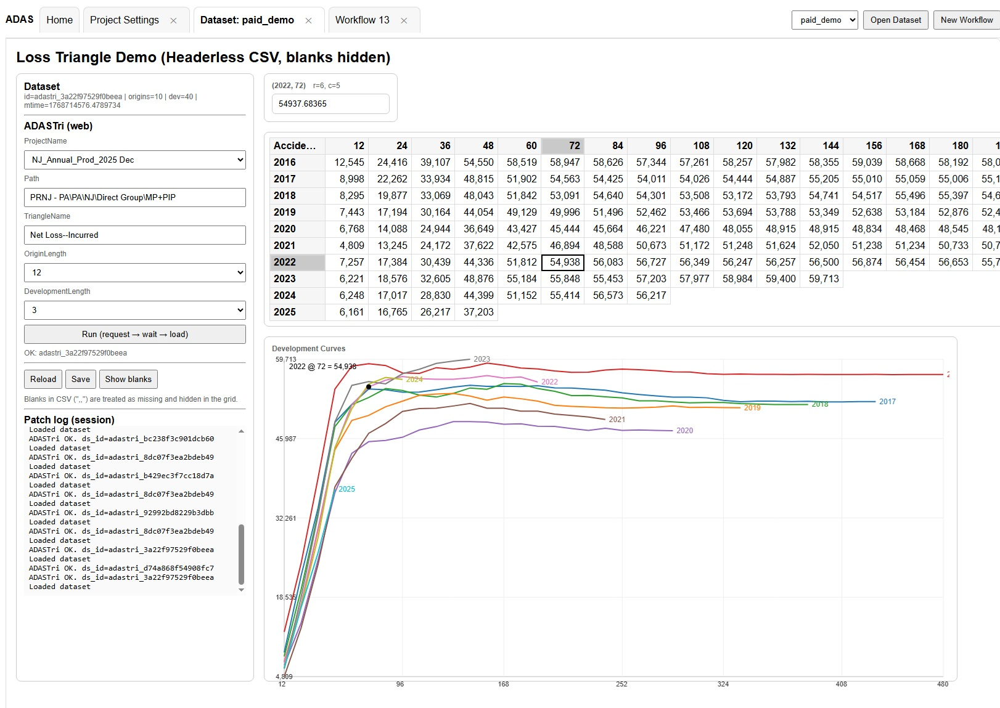

# Lytrx

Lytrx is a layered matrix analytics platform designed for actuarial reserving, modeling,
and workflow automation. It integrates Excel-based workflows, Python analytics services,
and a modern web UI to support structured, repeatable decision-making.

## Frontend Preview

