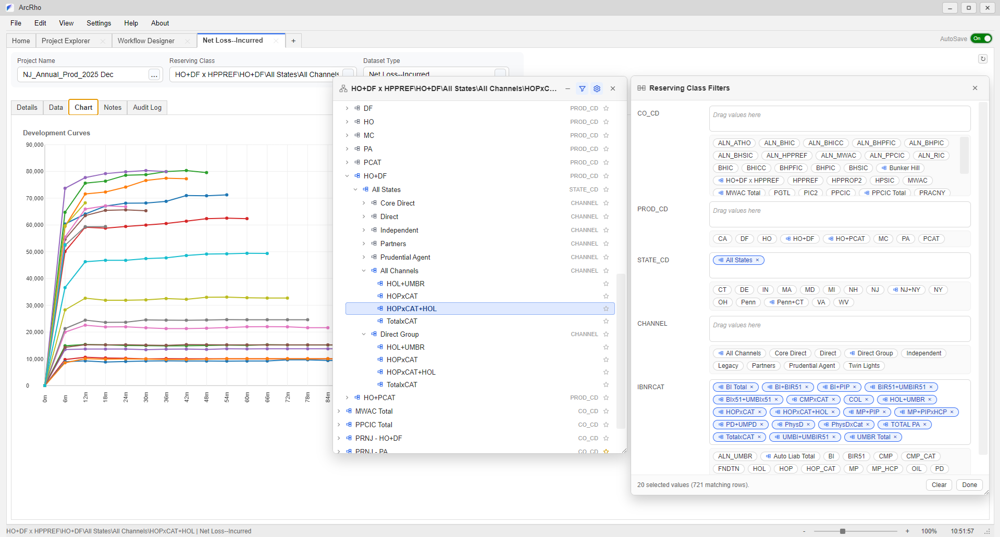
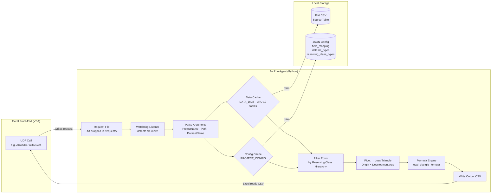
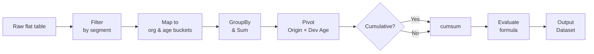
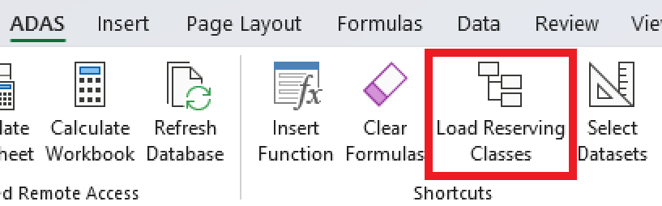
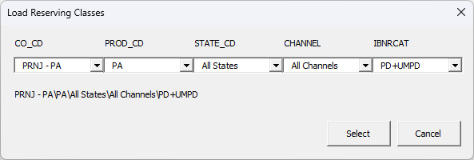
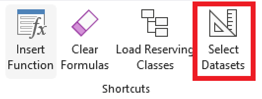
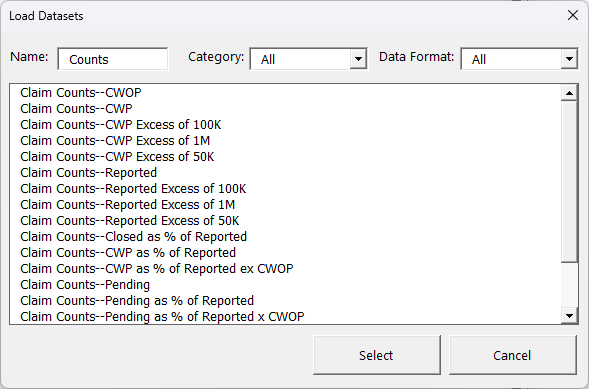

# ArcRho

ArcRho is an actuarial data automation platform focused on loss reserving analytics.
It provides a structured framework for transforming insurance loss data into reproducible reserving workflows, helping actuaries reduce manual effort while maintaining transparency and control over assumptions.

## Background & Motivation

Reserving teams face growing pressure from shifting claims settlement patterns, extraordinary loss events, and rapid operational changes — yet the tools most teams rely on were not built for this pace. The typical workflow stitches together a traditional vendor platform and a collection of Excel worksheets, connected by significant manual effort at every data handoff.

The core problems are structural: the traditional vendor platform's hierarchical project model requires all datasets to be pre-computed before any can be accessed (a process that can consume half a working day), stores tens of thousands of datasets that are rarely used, and demands manual intervention whenever new coverage codes or company hierarchies are introduced. Automation APIs exist but remain inaccessible to most users without specialized scripting knowledge — so repetitive, low-value work crowds out strategic analysis every reserving cycle.

ArcRho was built to break this pattern. By replacing the pre-computation model with on-demand query execution directly against flat source tables, and exposing the results through familiar Excel formulas, it eliminates manual data transfers, removes vendor dependency, and gives the reserving team the speed and flexibility to respond to emerging trends without waiting on system constraints.

## Frontend Preview


## Interactive Chart for Chain-Ladder Method


---

## Data Processing Engine

ArcRho replaces the traditional vendor-based reserving database with a lightweight, local computation engine that queries flat CSV source tables on demand, builds loss triangles in memory, and returns results directly to Excel — with no pre-computation, no rigid project hierarchy, and no lengthy load times.

### Architecture Overview


```mermaid
flowchart LR
    subgraph Excel["Excel Front-End (VBA)"]
        A[UDF Call\ne.g. ADASTri / ADASVec]
    end

    subgraph Engine["ArcRho Agent (Python)"]
        B[Request File\n.txt dropped in /requests/]
        C[Watchdog Listener\ndetects file move]
        D[Parse Arguments\nProjectName · Path · DatasetName]
        E{Config Cache\nPROJECT_CONFIG}
        F{Data Cache\nDATA_DICT · LRU 10 tables}
        G[Filter Rows\nby Reserving Class Hierarchy]
        H[Pivot → Loss Triangle\nOrigin × Development Age]
        I[Formula Engine\neval_triangle_formula]
        J[Write Output CSV]
    end

    subgraph Storage["Local Storage"]
        K[(Flat CSV\nSource Table)]
        L[(JSON Config\nfield_mapping\ndataset_types\nreserving_class_types)]
    end

    A -->|writes request| B
    B --> C --> D
    D --> E
    E -->|miss| L
    D --> F
    F -->|miss| K
    F --> G
    E --> G
    G --> H --> I --> J
    J -->|Excel reads CSV| A
```

### How It Works

**1. Request-driven computation**
Every Excel formula call (e.g. `=ADASTri(...)`) writes a small `.txt` request file into a watched folder. The Python agent detects the file via `watchdog`, parses the arguments, executes the calculation, and writes the result as a CSV — which Excel reads back into the cell range. No data is computed until it is explicitly requested.

**2. Flat table + JSON configuration**
Source data lives in a single flat CSV file per project (one row per origin–development observation). Project structure is defined entirely in three JSON files:

| File | Purpose |
|---|---|
| `field_mapping.json` | Maps raw column names to actuarial significance (Origin Date, Development Date, Reserving Class levels) |
| `dataset_types.json` | Defines named datasets and their source formulas (e.g. `Paid_Loss / Earned_Exposure`) |
| `reserving_class_types.json` | Defines the class hierarchy — inclusions, exclusions, and adjustments per level |

**3. In-memory LRU cache**
Loaded source tables and project configs are held in memory (`DATA_DICT`, `PROJECT_CONFIG`). Staleness is detected by comparing file modification timestamps, so updates take effect automatically without restarting the agent. The data cache evicts the oldest table when it exceeds 10 entries.

**4. Triangle construction pipeline**


```mermaid
flowchart LR
    A[Raw flat table] --> B[Filter\nby segment]
    B --> C[Map to\norg & age buckets]
    C --> D[GroupBy\n& Sum]
    D --> E[Pivot\nOrigin × Dev Age]
    E --> F{Cumulative?}
    F -->|Yes| G[cumsum]
    F -->|No| G
    G --> H[Evaluate\nformula]
    H --> J[Output\nDataset]
```

**5. Formula engine**
Dataset formulas are evaluated as arithmetic expressions over aligned triangle DataFrames (e.g. `D = A / B * 1000`). pandas alignment handles index/column matching automatically, and division-by-zero cells are replaced with zero.

---

### Advantages Over Traditional Reserving Databases

| | ArcRho | Traditional Vendor Platform |
|---|---|---|
| **Data structure** | Normalized grain-level fact table | Fixed hierarchical project tree |
| **Project setup** | Edit JSON config files | Rebuild project hierarchy in GUI |
| **Computation model** | On-demand, per request | Pre-compute all datasets before access |
| **Load time** | Near-instant (cached) | Up to half a day for large monthly projects |
| **Storage footprint** | Only source data stored | 10,000+ pre-computed datasets per project |
| **New class / coverage** | Update JSON, request resolves immediately | Manual intervention to fix aggregation dependencies |
| **Custom aggregations** | Define in `reserving_class_types.json` at any time | Requires project rebuild |
| **Formula datasets** | Arithmetic expressions over triangles | Predefined dataset types only |
| **Excel integration** | Drop-in VBA functions matching existing syntax | Vendor-bundled Excel Add-In |
| **Infrastructure** | Runs locally on any machine | Depends on remote server / vendor application |

---

## Excel Add-in

The ArcRho Excel Add-in exposes the data processing engine directly inside Excel through a set of worksheet functions (UDFs) and a custom **ADAS** ribbon tab. Actuaries work entirely within familiar Excel workflows — no scripting, no vendor GUI — while the Python backend handles all data retrieval and triangle construction transparently.

### Ribbon



The **ADAS** ribbon tab provides quick-access shortcuts for the two most common setup actions before calling any formula:

| Button | Purpose |
|---|---|
| **Load Reserving Classes** | Opens a dialog to select and confirm a reserving class path (e.g. `PRNJ-PA\PA\All States\All Channels\PD+UMPD`) |
| **Select Datasets** | Opens a searchable list of all available datasets for the active project |
| **Insert Function** | Inserts a UDF template into the active cell |
| **Clear Formulas** | Removes all ADAS/Arc formulas from the active sheet |
| **Calculate Workbook** | Forces a full recalculation |
| **Refresh Database** | Reloads the source data cache on the backend |

### Step 1 — Select a Reserving Class Path



Click **Load Reserving Classes** in the ribbon. The dialog presents a cascading set of dropdowns corresponding to the reserving class hierarchy (Company → Product → State → Channel → IBNR Category). Each selection narrows the next level. The resulting path string (shown at the bottom of the dialog) is what you pass as the `Path` argument to any UDF.

### Step 2 — Select a Dataset




Click **Select Datasets** to browse all datasets defined for the active project. Results can be filtered by name, category, or data format. The selected dataset name maps directly to the `TriangleName` / `VectorName` argument in the formulas below.

---

### UDF Reference

All functions are available under both the `ADAS` prefix and the `Arc` alias prefix (e.g. `ADASTri` ≡ `ArcTri`).

#### Triangle Functions

```
=ADASTri(Path, TriangleName, [Cumulative], [Transposed], [Calendar],
         [ProjectName], [OriginLength], [DevelopmentLength])
```
Returns a full loss triangle as a spilled array. `Path` is the reserving class path; `TriangleName` is the dataset name. `Cumulative` (default `TRUE`) controls whether development values are cumulated. `OriginLength` and `DevelopmentLength` set the aggregation period in months (default 12 = annual).

```
=ADASTriDiag(Path, TriangleName, [DiagonalIndex], [Cumulative], [Transposed], ...)
```
Returns a single diagonal of the triangle. `DiagonalIndex = 0` (default) returns the latest diagonal; negative values step back.

```
=ADASTriOrigin(Path, TriangleName, OriginPeriod, [Cumulative], [Transposed], ...)
```
Returns a single row (one origin period) across all development ages.

```
=ADASTriCell(Path, TriangleName, OriginPeriod, DevelopmentPeriod, [Cumulative], ...)
```
Returns a single scalar cell from the triangle at a specified origin and development position.

#### Vector Functions

```
=ADASVec(Path, VectorName, [Transposed], [ProjectName], [PeriodLength])
```
Returns a one-dimensional origin-period vector (e.g. earned exposure, premium). Useful for vectors that do not have a development dimension.

```
=ADASVecCell(Path, VectorName, Index, [ProjectName], [PeriodLength])
```
Returns a single element from a vector by 1-based index.

#### Utility Functions

```
=ADASHeaders(periodType, Transposed, [PeriodLength], [ProjectName])
```
Returns axis labels for use as triangle headers. `periodType = 0` returns origin period labels; `periodType = 1` returns development age labels (e.g. `23m`, `35m`, …).

```
=ADASProjectSettings([ProjectName])
```
Returns project metadata as a spilled table: name, origin type, start/end dates, development end date, and period lengths. Useful for dynamic formula construction and audit trails.
